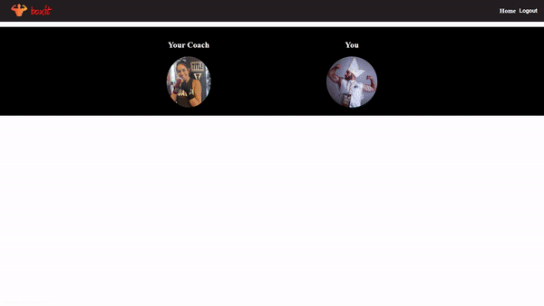
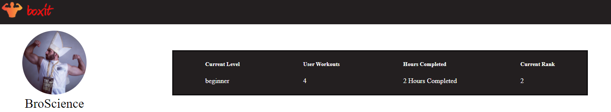
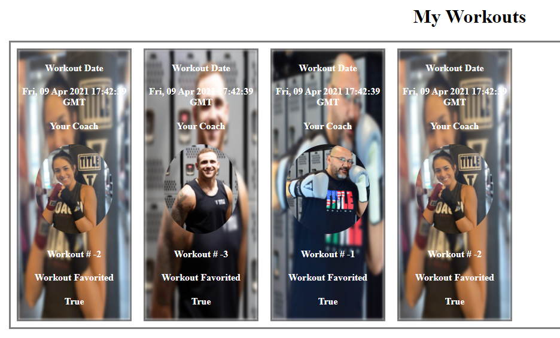

<!--
*** Thanks for checking out the Best-README-Template. If you have a suggestion
*** that would make this better, please fork the repo and create a pull request
*** or simply open an issue with the tag "enhancement".
*** Thanks again! Now go create something AMAZING! :D
***
***
***
*** To avoid retyping too much info. Do a search and replace for the following:
*** RoodeAwakening, Boxit, twitter_handle, derek.i.roode@gmail.com, BoxIt, Your AI Boxing Coach! Get the workout you deserve!
-->


<!-- PROJECT SHIELDS -->
<!--
*** I'm using markdown "reference style" links for readability.
*** Reference links are enclosed in brackets [ ] instead of parentheses ( ).
*** See the bottom of this document for the declaration of the reference variables
*** for contributors-url, forks-url, etc. This is an optional, concise syntax you may use.
*** https://www.markdownguide.org/basic-syntax/#reference-style-links
-->
[![Contributors][contributors-shield]][contributors-url]
[![Forks][forks-shield]][forks-url]
[![Stargazers][stars-shield]][stars-url]
[![Issues][issues-shield]][issues-url]
[![MIT License][license-shield]][license-url]
[![LinkedIn][linkedin-shield]][linkedin-url]

gitImages/boxit_logo.png

<!-- PROJECT LOGO -->
<br />
<p align="center">
  <a href="https://github.com/RoodeAwakening/Boxit">
    
  </a>

  <h3 align="center">BoxIt</h3>

  <p align="center">
    Your AI Boxing Coach! Get the workout you deserve!
    <br />
    <a href="https://github.com/RoodeAwakening/Boxit"><strong>Explore the docs »</strong></a>
    <br />
    <br />
    <a href="https://github.com/RoodeAwakening/Boxit">View Demo</a>
    ·
    <a href="https://github.com/RoodeAwakening/Boxit/issues">Report Bug</a>
    ·
    <a href="https://github.com/RoodeAwakening/Boxit/issues">Request Feature</a>
  </p>
</p>


<!-- TABLE OF CONTENTS -->
<details open="open">
  <summary><h2 style="display: inline-block">Table of Contents</h2></summary>
  <ol>
    <li>
      <a href="#about-the-project">About The Project</a>
      <ul>
        <li><a href="#built-with">Built With</a></li>
      </ul>
    </li>
    <li>
      <a href="#getting-started">Getting Started</a>
      <ul>
        <li><a href="#installation">Installation</a></li>
      </ul>
    </li>
    <li><a href="#usage">Usage</a></li>
    <li><a href="#roadmap">Roadmap</a></li>
    <li><a href="#contributing">Contributing</a></li>
    <li><a href="#license">License</a></li>
    <li><a href="#contact">Contact</a></li>

  </ol>
</details>


<!-- ABOUT THE PROJECT -->
## About The Project

[![Product Name Screen Shot][product-screenshot]](https://example.com)


### Built With


* [React](https://reactjs.org/docs/hooks-effect.html)
* [Python](https://www.python.org/)
* [Flask](https://flask.palletsprojects.com/en/1.1.x/)
* [SQLAlchemy](https://www.sqlalchemy.org/)
* [Redux](https://redux.js.org/)


<!-- GETTING STARTED -->
## Getting Started

To get a local copy up and running follow these simple steps.

### Prerequisites


### Installation

1. Clone the repo
   ```sh
   git clone https://github.com/RoodeAwakening/Boxit.git
   ```
2. Install NPM packages
      ```sh
      pipenv install --dev -r dev-requirements.txt && pipenv install -r requirements.txt
      ```      
3. Create a **.env** file based on the example with proper settings for your
   development environment
4. Setup your PostgreSQL user, password and database and make sure it matches your **.env** file

5. Get into your pipenv, migrate your database, seed your database, and run your flask app

   ```bash
   pipenv shell
   ```

   ```bash
   flask db upgrade
   ```

   ```bash
   flask seed all
   ```

   ```bash
   flask run
   ```  
6. Start the front end and back end
   ```sh
    frontend - 
    cd react-app npm start
    backend - 
    flask run
   ```
***
*IMPORTANT!*
   If you add any python dependencies to your pipfiles, you'll need to regenerate your requirements.txt before deployment.
   You can do this by running:

   ```bash
   pipenv lock -r > requirements.txt
   ```

*ALSO IMPORTANT!*
   psycopg2-binary MUST remain a dev dependency because you can't install it on apline-linux.
   There is a layer in the Dockerfile that will install psycopg2 (not binary) for us.
***


<!-- USAGE EXAMPLES -->
## Usage

This website was designed as an alternative to going to a boxing gym. Giving you a personalized workout in the comfort of your own home!

_For more examples, please refer to the [Documentation](https://example.com)_

### Eye catching splash screen
  

### A full featured workout screen
  

### Easy to access workout stats


### View your most recent workouts



<!-- ROADMAP -->
## Roadmap

See the [open issues](https://github.com/RoodeAwakening/Boxit/issues) for a list of proposed features (and known issues).


<!-- CONTRIBUTING -->
## Contributing

Contributions are what make the open source community such an amazing place to be learn, inspire, and create. Any contributions you make are **greatly appreciated**.

1. Fork the Project
2. Create your Feature Branch (`git checkout -b feature/AmazingFeature`)
3. Commit your Changes (`git commit -m 'Add some AmazingFeature'`)
4. Push to the Branch (`git push origin feature/AmazingFeature`)
5. Open a Pull Request


<!-- LICENSE -->
## License

Distributed under the MIT License. See `LICENSE` for more information.


<!-- CONTACT -->
## Contact

Derek Roode - Derek.I.Roode@gmail.com

Project Link: [https://github.com/RoodeAwakening/Boxit](https://github.com/RoodeAwakening/Boxit)


<!-- MARKDOWN LINKS & IMAGES -->
<!-- https://www.markdownguide.org/basic-syntax/#reference-style-links -->
[contributors-shield]: https://img.shields.io/github/contributors/RoodeAwakening/BoxIt.svg?style=for-the-badge
[contributors-url]: https://github.com/RoodeAwakening/BoxIt/graphs/contributors
[forks-shield]: https://img.shields.io/github/forks/RoodeAwakening/BoxIt.svg?style=for-the-badge
[forks-url]: https://github.com/RoodeAwakening/BoxIt/network/members
[stars-shield]: https://img.shields.io/github/stars/RoodeAwakening/BoxIt.svg?style=for-the-badge
[stars-url]: https://github.com/RoodeAwakening/BoxIt/stargazers
[issues-shield]: https://img.shields.io/github/issues/RoodeAwakening/BoxIt.svg?style=for-the-badge
[issues-url]: https://github.com/RoodeAwakening/BoxIt/issues
[license-shield]: https://img.shields.io/github/license/RoodeAwakening/BoxIt.svg?style=for-the-badge
[license-url]: https://github.com/RoodeAwakening/BoxIt/blob/master/LICENSE.txt
[linkedin-shield]: https://img.shields.io/badge/-LinkedIn-black.svg?style=for-the-badge&logo=linkedin&colorB=555
[linkedin-url]: https://www.linkedin.com/in/derek-roode-9014a796/

